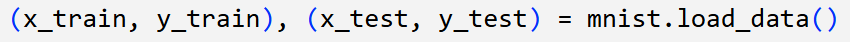

# DOKUMENTACIJA ZAVRŠNOG PRAKTIČNOG PROJEKTA
## Prepoznavanje znamenki korištenjem SVD dekompozicije

---

## UVOD
Prepoznavanje rukom pisanih znamenki jedno je od klasičnih problemskih područja strojnog učenja.  
Za ovaj projekt korišten je **MNIST dataset**, koji sadrži 70 000 slika znamenki (0–9), svaka dimenzija 28×28 piksela.  

Cilj projekta je iskoristiti **Singular Value Decomposition (SVD)** za izgradnju klasifikatora znamenki.  
Ideja je da svaka klasa znamenke (0–9) može biti dobro opisana pomoću vlastitog **potprostora** generiranog SVD-om, a nova slika se klasificira prema tome kojem je potprostoru najbliža.

---

## BIBLIOTEKE
- **NumPy** – za rad s matricama i algebarske operacije  
- **Matplotlib** – za vizualizaciju slika i rezultata  
- **TensorFlow/Keras** – za učitavanje MNIST dataseta  
- **Dataclasses / Typing** – pomoćne strukture i tipovi podataka
- **Pyplot** - podmodul unutar biblioteke Matplotlib koji omogućuje uredan i jasan grafički prikaz

---

## UČITAVANJE PODATAKA
Podaci su preuzeti iz MNIST dataseta:
 

Dataset je podijeljen na:  
- **trening skup**: 60 000 slika  
- **test skup**: 10 000 slika  
Slike su normalizirane dijeljenjem s 255, tako da pikseli imaju vrijednosti između 0 i 1. Svaka je slika dimenzije 28x28.

Primjer jedne slike iz trening skupa: 

---

## PRIPREMA PODATAKA
Za treniranje klasifikatora odabire se **fiksan broj slika po klasi** (npr. 100 slika za svaku znamenku).  
Svaka slika dimenzija 28×28 pretvara se u vektor dimenzije 784, tako da se slike mogu slagati u matricu oblika:

A_d ∈ R^(784 × n)
gdje je `d` oznaka klase (znamenke), a `n` broj odabranih slika za tu klasu.
---

## PRIMJENA SVD DEKOMPOZICIJE
Za svaku klasu znamenke `d` računa se SVD dekompozicija:

- `U_d` sadrži ortogonalne bazne vektore (potprostor klase)  
- `S_d` je dijagonalna matrica singularnih vrijednosti  
- `V_d^T` matrica s desne strane 

Zadržavanjem samo prvih `r` singularnih vrijednosti dobivamo **aproksimaciju slike** i redukciju dimenzionalnosti.  
Postoje dvije varijante određivanja ranga:
1. **Adaptivni prag** – uzimaju se svi singularni vektori čije vrijednosti prelaze zadani relativni prag  

(2. **Efektivni rang** – definira se pomoću informacijske entropije singularnih vrijednosti)
---

## KLASIFIKATOR
Nova slika `x` klasificira se na temelju **projekcije na potprostore svih klasa**.  
Za svaku klasu `d` računa se kut između slike `x` i njezine projekcije na bazu `U_d`. Klasa kojoj pripada najmanji kut proglašava se kao predikcija.
 

*** OPIŠI UKRATKO LOGIKU TE FUNKCIJE
---

## EVALUACIJA
Klasifikator je testiran na cijelom **MNIST test skupu (10 000 slika)**.  
Mjeren je postotak točno prepoznatih znamenki.  

- Točnost ovisi o izboru ranga `r`. Za male rangove klasifikator gubi na preciznosti. Povećanjem `r` točnost raste, ali raste i dimenzionalnost.
---

## REZULTATI

---

## AUTOR
Lara Slišković, Violeta Tomašević – [GitHub profil](https://github.com/tvojprofil)